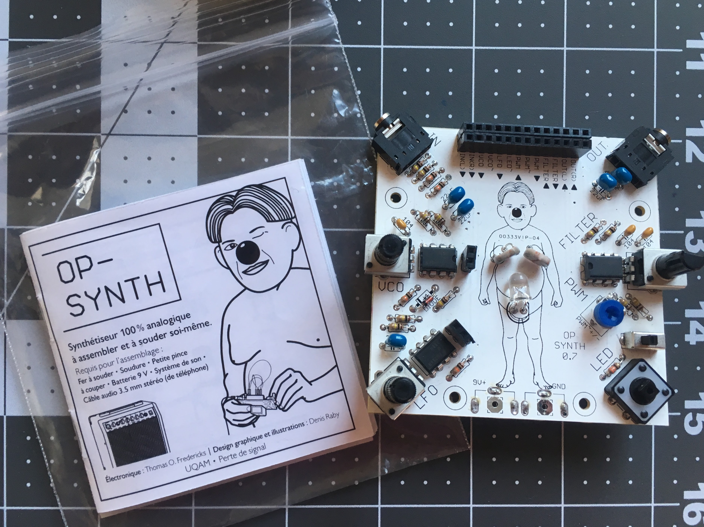

# Op-Synth

Op-Synth is an open-source modular micro analog synthesizer designed to facilitate the understanding of electronics, audio synthesis, sound theory, and filtering.

Op-Synth is a 100% analog kit that requires assembly. It is easy to build and serves as an excellent introduction to electronics. It teaches the basic principles of sound synthesis through a modular patch bay, just like a traditional modular analog synthesizer. It also features an LED that helps visualize the evolution of the sound signal, serving as a basic introduction to synesthesia.

In addition to generating its own audio signal, the Op-Synth includes an audio input, allowing musicians to manipulate sounds from their cellphone, music player, or electric guitar. Multiple Op-Synths can be chained together to create more complex sonic textures. Despite its small size (3" x 3"), this synthesizer is powerful and affordable.

All circuitry is built as independent modules that are easy to isolate, understand, and hack.

## Videos

* [Op-Synth Introduction](https://vimeo.com/214735193)
* [Op-Synth Basics Tutorial](https://vimeo.com/225257448)
* [Op-Synth : Adding the Optional External Photocell and Diode](https://vimeo.com/225840352)
* [Op-Synth : External Input](https://vimeo.com/209483661)
* [Op-Synth Hacking : External LED](https://vimeo.com/212077716)

## Credits

* Electronics : Thomas O Fredericks
* Graphical design and illustrations : Denis Raby 

## Booklet

[20 page booklet in French](Op-Synth(livret).pdf)

## Technical Specifications

* 1x resistance controlled (either with a potentiometer or light sensitive sensor) triangle oscillator
* 1x pitch modulation of the previous oscillator
* 1x resistance controlled (either with a potentiometer or light sensitive sensor) low frequency triangle oscillator
* 1x light and resistance controlled filter with feedback control
* 1x PWM (pulse width modulation) module that can also distort and output square waves
* 1x switch that turns on the LED
* 1x LED (the led can be controlled with the switch or another signal)
* 1x stereo output (two independent signals)
* 1x stereo input (two independent signals)
* 5V to 9V battery powered

### Inputs and Outputs of the Patchbay

* in left
* in right
* vco : resistance controlled oscillator
* ~vco : pitch modulation
* lfo : low frequency resistance controlled oscillator
* ~led : led modulation
* pwm (input, modulation, output) : pulse width modulation
* filter in
* filter out
* out left
* out right

